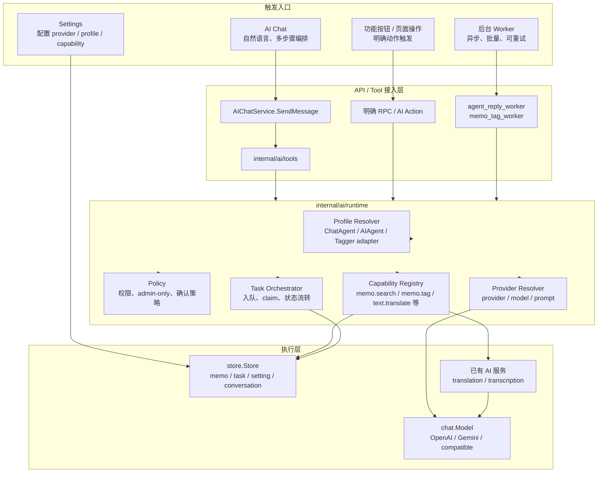
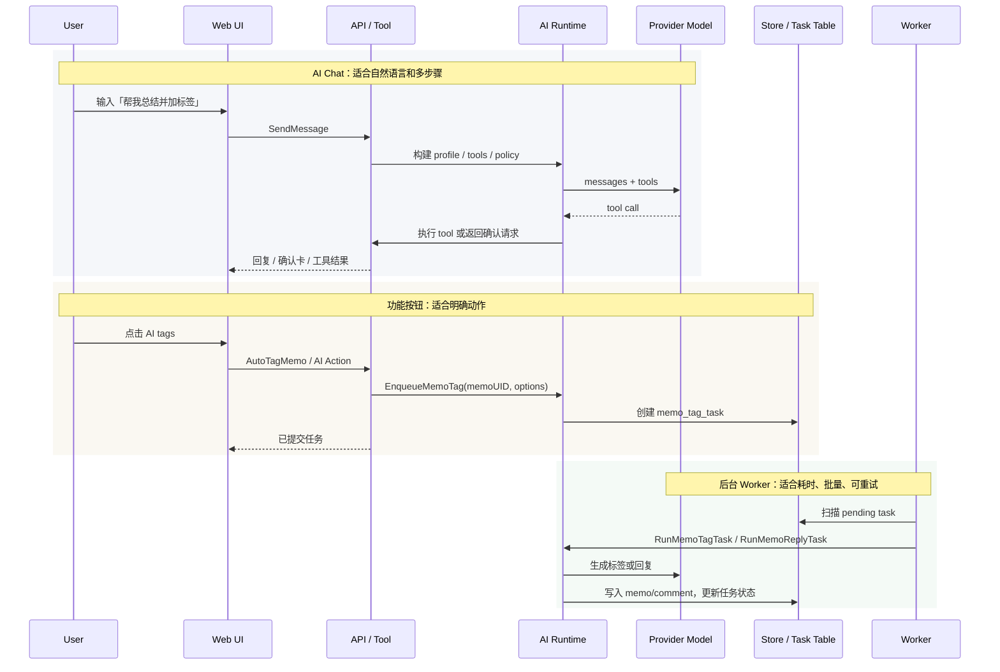
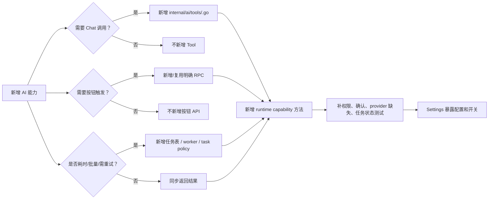

# AI 能力统一 Agent 架构方案

> 状态：架构梳理与阶段方案
> 日期：2026-09-04
> 依据：当前 `dev` 代码核查结果
> 目标：先收敛 memos 中分散的 AI 功能，只保留 AI Chat、Chatbot 工具、翻译和共享记忆；AI tags、AI comment、语音转文本先隐藏/冻结，后续再决定是否恢复。

## 0. 阅读顺序

如果是马上开发，请优先看：

1. 第 9 章：当前推荐实施阶段。
2. 第 14 章：Admin AI Settings 应该长什么样。
3. 第 15 章：按当前代码落地的文件级实施清单。

第 3-8 章是长期架构背景，用来解释为什么后续需要 runtime、capability、workflow 这些概念；当前第一期不要按这些章节去恢复 AI tags、AI comment 或语音转文本。

当前第一期最终产品范围：

| 功能 | 当前处理 |
|---|---|
| AI Chat | 保留 |
| memo 菜单 Ask AI | 保留 |
| Chatbot 工具 | 保留，但不暴露 `auto_tag`、`agent_reply`；保留 `query_queue` |
| 翻译页 | 保留 |
| 共享记忆 | 保留 |
| Provider / LLM 测试 | 保留 |
| AI tags | 隐藏/冻结 |
| AI comment | 隐藏/冻结 |
| 语音转文本 | 隐藏/冻结 |
| Workflows 页面 | 暂不做 |
| 独立 Diagnostics 页面 | 暂不做 |

## 1. 结论

当前不建议引入 LangChain、llamaindex 等外部 Agent 框架。

当前开发结论分两层：

1. **产品面先收敛**：AI Settings 只展示 Chat、Chatbot 工具、翻译、共享记忆和 LLM/Agent 基础配置；不要继续展示 AI tags、AI comment、语音转文本、Workflows、独立 Diagnostics。
2. **底层能力再统一**：不要直接物理删除 proto、数据库表和旧 worker；先把入口隐藏、工具不暴露、后台不产生新任务，等 Chat/Translation 稳定后再决定是否删除旧代码。

一个重要现实：当前代码还不能真正做到“当前 Chat 内自由组合 Agent + LLM”。现在 `conversation` 只保存 `agent_id`，而 `ChatAgentConfig` 自己绑定 `provider_id + model`。如果要做参考图那种 `Agent pill + LLM pill`，需要补一个轻量 LLM 配置和会话级 `llm_id`，否则只是 UI 外观变化，实际仍然是 Agent 绑定模型。

项目里已经有一套轻量原生 Agent 基础：

- `internal/ai/chat`：统一文本生成接口 `chat.Model`。
- `internal/ai/chat/openai`、`internal/ai/chat/gemini`：provider 适配层。
- `internal/ai/agent/factory.go`：按实例 AI provider 配置创建 chat model。
- `internal/ai/assistant`：对话式 tool loop，支持模型选择工具、执行工具、回填结果、确认流。
- `internal/ai/tools`：工具注册表和具体工具实现。
- `server/router/api/v1/agent_reply_worker.go`、`memo_tag_worker.go`：后台 AI 任务。
- `server/router/api/v1/ai_service.go`：转写、翻译等普通 RPC AI 能力。

更适合的方向是：在现有原生实现上增加一层薄的 **Memos AI Runtime / Agent Runtime**，把 provider、agent profile、工具、权限、确认、异步任务统一治理起来。

核心原则：

- 统一底层能力，不统一成唯一入口。
- Chat 负责自然语言编排。
- 按钮负责明确动作触发。
- Worker 负责异步、批量、可重试任务。
- 真正执行功能的永远是后端受控代码，不让模型直接“实现业务”。

## 2. 当前现状

### 2.1 已经比较好的地方

#### Provider 抽象已经清楚

`chat.Model` 抽象把 OpenAI / Gemini 文本生成统一成：

```go
Generate(ctx context.Context, req chat.Request) (*chat.Response, error)
```

这对二开是好事：新增 provider 时，只要实现 `chat.Model`，上层 AI Chat、自动回复、自动标签都可以复用。

#### Tool 抽象已经具备

`internal/ai/tools.Tool` 已经定义了：

- `Spec()`：暴露给模型的工具说明和 JSON Schema。
- `RequiresConfirmation()`：是否需要用户确认。
- `Run()`：后端真实执行。

这套抽象比直接接外部框架更贴合当前项目，因为它天然知道：

- 当前用户是谁。
- 如何访问 `store.Store`。
- 哪些工具 admin-only。
- 哪些写操作需要确认。

#### Chat tool loop 已经可用

`assistant.ToolLoop` 已经能完成：

1. 把系统提示词、历史消息、工具列表发给模型。
2. 模型返回 tool calls。
3. 后端执行工具。
4. 工具结果回填给模型。
5. 模型生成最终自然语言回复。

这已经是一个标准的轻量 Agent 执行循环。

#### 异步任务已有基础

自动评论和自动标签已经有任务表：

- `agent_reply_task`
- `memo_tag_task`

并且有 worker 周期扫描、执行、标记状态。

这说明项目已经具备“明确入口触发任务，后台 AI 执行”的基础。

### 2.2 当前比较散的地方

#### AI 配置模型分散

`InstanceAISetting` 里现在有多类配置：

- `providers`
- `transcription`
- `translation`
- `agents`
- `taggers`
- `chat_agents`
- `tools`
- `memory`

这些配置都合理，但缺少一个更上层的“能力清单 / runtime policy”概念。结果是每个功能自己决定怎么找 provider、怎么拼 prompt、怎么限制权限。

#### 执行入口分散

目前至少有三类入口：

- AI Chat：`SendMessage` 走 `assistant.ToolLoop`。
- 功能按钮：例如手动自动标签、翻译、转写走各自 RPC。
- 后台任务：自动评论、自动标签走 worker。

入口分散没问题，但现在底层编排也分散，导致后续新增能力容易复制逻辑。

#### Prompt 构造分散

自动评论在 `buildAgentSystemPrompt`、`buildAgentUserPrompt` 里拼。

自动标签在 `buildTaggerSystemPrompt`、`buildTaggerUserPrompt` 里拼。

AI Chat 又有自己的 system prompt、operational guidance、memory context。

这些逻辑目前还能维护，但随着能力变多，会越来越难知道“哪个 prompt 控制哪个能力”。

#### 手动触发工具有不稳点

`internal/ai/tools/agent_reply.go` 和 `auto_tag.go` 是 Chat 里的工具，用来触发后台任务。

但当前工具只传 `memoUid`，没有让模型或用户明确指定 `agentId` / `taggerId`。而后台任务结构本身已经有 `agent_id` / `tagger_id` 字段。

后续需要梳理这里，否则“触发哪一个 Agent / Tagger”语义会不够清楚，也不利于排障和二开。

## 3. 推荐目标架构

本章是长期目标，不是第一期必须全部实现。当前第一期只做功能收敛、Chat/Translation 保留、Admin AI Settings 简化；涉及 AI tags、AI comment、语音转文本的内容仅作为后续恢复时的参考。

建议增加一个内部 runtime 层，名字可以先叫：

```text
internal/ai/runtime
```

职责不是替代现有工具，而是统一这些重复步骤：

```text
入口
  -> 解析当前用户和能力请求
  -> 读取 InstanceAISetting
  -> 解析 provider / model / agent profile
  -> 应用权限策略
  -> 执行同步工具或创建异步任务
  -> 返回结构化结果
```

目标结构：

```text
AI Chat
  -> assistant.ToolLoop
  -> tools
  -> runtime

功能按钮
  -> Action RPC
  -> runtime

后台 worker
  -> runtime

Settings
  -> 管理 LLMs / Agents / Capabilities / Workflows
```

注意：这里不是把所有功能都塞进 Chat。Chat 只是入口之一。本图是长期方向，第一期 Settings 只落地 LLMs / Agents / Chat Tools / Translation / Memory。

## 4. 核心概念设计

### 4.1 Provider

保持现有 `AIProviderConfig`。

它只负责连接模型：

- provider id
- type
- endpoint
- api key

不建议在 provider 上放具体业务能力，比如“这个 provider 是标签专用”。业务能力应该在 profile/capability 层表达。

### 4.2 Agent Profile

建议把现在几种 AI 配置逐步收敛为更统一的 profile 思路。

短期不一定要改 proto，可以先在代码层统一抽象：

```go
type Profile struct {
  ID string
  Name string
  Kind string
  ProviderID string
  Model string
  SystemPrompt string
  Tools []string
}
```

不同来源映射到这个 Profile：

- `ChatAgentConfig` -> kind=`chat`
- `AIAgentConfig` -> kind=`memo_reply`
- `TaggerConfig` -> kind=`memo_tag`
- `TranslationConfig` -> kind=`translation`
- `TranscriptionConfig` -> kind=`transcription`

这样上层功能不再关心 proto 里具体字段叫什么，而是统一向 runtime 要一个 profile。

### 4.3 Capability

建议把每种 AI 能力定义成内部 capability。

示例：

```text
memo.search
memo.read
memo.create
memo.update
memo.tag.apply
memo.tag.enqueue
memo.reply.enqueue
memo.reply.generate
text.translate
audio.transcribe
admin.queue.inspect
admin.project.inspect
memory.read
memory.write
```

Capability 负责表达：

- 能力名
- 是否只读
- 是否 admin-only
- 是否需要确认
- 是否同步执行
- 是否异步任务
- 对应 tool 名称
- 对应按钮/RPC 动作

这层是后续二开最重要的扩展点。

### 4.4 Tool

继续保留 `internal/ai/tools.Tool`。

但建议让 tool 尽量变薄：

```text
Tool.Run()
  -> 参数校验
  -> 权限校验
  -> 调 runtime capability
  -> 返回结构化结果
```

不要让每个 tool 自己重复找 provider、拼 prompt、写任务、处理权限。

### 4.5 Workflow / Task

耗时、批量、需要幂等的能力继续走任务表。

适合任务化：

- 自动评论
- 自动标签
- 长音频转写
- 批量摘要
- 批量重写标题
- 每日回顾生成

不适合任务化：

- 短文本翻译
- 查询项目状态
- 搜索 memo
- 读取 memo

## 5. 多入口触发方式

### 5.1 Chat 触发

适合自然语言、多步骤、不确定意图：

```text
用户：帮我找最近关于部署的 memo，总结一下，并给它们加 #deployment
AI Chat
  -> LLM 选择 search_memos
  -> LLM 选择 batch_update_memos
  -> 写操作展示确认卡
  -> 后端执行
  -> LLM 总结结果
```

特点：

- 模型负责选择工具。
- 后端负责执行工具。
- 写操作必须确认。
- 权限由后端强制。

### 5.2 按钮触发

适合明确动作：

```text
用户点击“AI tags”
  -> 前端调用 AutoTagMemo 或新的 AIAction RPC
  -> 后端直接调用 runtime.EnqueueMemoTag(...)
  -> 创建 memo_tag_task
  -> worker 执行
```

按钮触发不应该让模型先判断“用户是不是要打标签”。用户点按钮已经表达了意图。

更好的按钮路径：

```text
Button
  -> Action API
  -> runtime capability
  -> sync result 或 task id
```

### 5.3 后台自动触发

适合新 memo 创建后的自动动作：

```text
CreateMemo
  -> scheduleAutoTagForMemo
  -> scheduleAgentRepliesForMemo
  -> task table
  -> worker
  -> runtime
```

后续可以让后台任务也通过 runtime 执行生成逻辑，而不是 worker 自己拼 prompt 和建 model。

## 6. 推荐代码落点

### 6.1 新增 runtime 包

建议新增：

```text
internal/ai/runtime/
  runtime.go
  profile.go
  capability.go
  policy.go
  provider.go
  memo_tag.go
  memo_reply.go
  translation.go
  transcription.go
```

初期不需要一次建很多文件，可以先从少量文件开始：

```text
internal/ai/runtime/runtime.go
internal/ai/runtime/profile.go
internal/ai/runtime/memo_tag.go
internal/ai/runtime/memo_reply.go
```

### 6.2 Runtime 接口草案

```go
type Runtime struct {
  Store *store.Store
}

type RequestContext struct {
  UserID int32
  Source Source
}

type Source string

const (
  SourceChat Source = "chat"
  SourceButton Source = "button"
  SourceWorker Source = "worker"
)
```

建议先支持这些方法：

```go
func (r *Runtime) ResolveChatProfile(ctx context.Context, agentID string) (*Profile, error)
func (r *Runtime) BuildChatModel(ctx context.Context, profile *Profile) (chat.Model, string, error)

func (r *Runtime) EnqueueMemoTag(ctx context.Context, rc RequestContext, memoUID string, opts MemoTagOptions) (*TaskResult, error)
func (r *Runtime) RunMemoTagTask(ctx context.Context, task *store.MemoTagTask) error

func (r *Runtime) EnqueueMemoReply(ctx context.Context, rc RequestContext, memoUID string, opts MemoReplyOptions) (*TaskResult, error)
func (r *Runtime) RunMemoReplyTask(ctx context.Context, task *store.AgentReplyTask) error
```

后续再补：

```go
func (r *Runtime) TranslateText(ctx context.Context, rc RequestContext, req TranslateTextRequest) (*TranslateTextResult, error)
func (r *Runtime) TranscribeAudio(ctx context.Context, rc RequestContext, req TranscribeAudioRequest) (*TranscribeAudioResult, error)
```

### 6.3 Tool 改造方向

例如 `auto_tag` tool：

当前：

```text
auto_tag tool
  -> 查 memo
  -> UpsertMemoTagTask
```

改造后：

```text
auto_tag tool
  -> parse args
  -> runtime.EnqueueMemoTag(...)
```

例如 `agent_reply` tool：

```text
agent_reply tool
  -> parse args
  -> runtime.EnqueueMemoReply(...)
```

这样 Chat 和按钮可以复用同一套 enqueue 逻辑。

### 6.4 Worker 改造方向

当前 worker 自己：

- 读取 AI setting
- 找 agent/tagger
- 找 provider
- 创建 model
- 拼 prompt
- 调 model
- 写 memo/comment

建议改成：

```text
worker
  -> list pending tasks
  -> runtime.RunMemoTagTask(task)
  -> runtime.RunMemoReplyTask(task)
```

worker 只负责扫描、限流、任务状态流转；runtime 负责 AI 业务执行。

## 7. 数据模型建议

### 7.1 短期不改 proto

第一阶段建议不改 `InstanceAISetting`，直接在 runtime 中做 adapter：

```text
ChatAgentConfig -> Profile
AIAgentConfig -> Profile
TaggerConfig -> Profile
TranslationConfig -> Profile
TranscriptionConfig -> Profile
```

好处：

- 风险低。
- 不需要迁移。
- 不需要改生成代码。
- 可以先把散落逻辑收拢起来。

### 7.2 中期再考虑统一 proto

当 runtime 稳定后，再考虑 proto 层统一：

```proto
message AICapabilityConfig {
  string id = 1;
  string name = 2;
  string kind = 3;
  string provider_id = 4;
  string model = 5;
  bool enabled = 6;
  string prompt = 7;
  repeated string tools = 8;
  map<string, string> options = 9;
}
```

但这一步不急。过早统一 proto 会带来迁移和兼容成本。

## 8. 权限与安全策略

必须把权限策略放在后端 runtime/tool 层，而不是只放前端。

建议规则：

- 普通用户只能读取/修改自己有权限的 memo。
- admin-only capability 只能 admin 使用。
- 写操作默认需要确认，按钮触发也要有明确 UI 反馈。
- 模型不能直接执行数据库 SQL，必须走白名单工具或结构化 capability。
- Provider API key 永远不返回前端，不进入模型上下文。
- 后台 worker 使用系统上下文时必须有明确来源标记，避免触发通知/循环任务。

当前已有基础：

- `applyToolConfig` 会移除非管理员的 admin-only tools。
- `RequiresConfirmation` 已经能保护写工具。
- `withSystemAgentCall` / `withSuppressMentionNotifications` 已经用于系统任务隔离。

需要增强：

- 把权限策略抽到 runtime/policy。
- 给每个 capability 写权限测试。
- 明确 button source、chat source、worker source 的权限差异。

## 9. 第一期统一实施方案

本章是当前唯一执行方案。前面的 runtime / capability / workflow 章节只作为长期参考，第一期不要实现 AI tags、AI comment、语音转文本、Workflows 页面或独立 Diagnostics 页面。

### 9.1 第一期目标

把 AI 功能收敛到一个清楚、可维护、方便二开的范围：

```text
保留：
AI Chat
Ask AI
Chatbot Tools
Translation
Memory
LLM / Provider test

隐藏/冻结：
AI tags
AI comment
Audio transcription
Workflows
Diagnostics page
```

核心原则：

- 先收敛产品入口，再重构设置页。
- 只隐藏/冻结旧功能，不物理删除 proto、数据库表和迁移。
- 后端工具暴露面必须同步收敛，不能只做前端隐藏。
- 真正 `Agent + LLM` 自由组合放到下一期，因为它需要 proto、store、DB migration 和 Chat API 改动。

### 9.2 第一期拆分

第一期分三步做，建议三个小提交完成。

第一步：收敛工具和入口。

- Chat 后端不再暴露 `auto_tag`、`agent_reply`；保留 `query_queue`。
- Admin Chat Tools 不再显示这三个工具。
- Memo 菜单保留 `Ask AI`，移除 `AI tags`。
- Memo 录音面板移除 `Transcribe` 入口，只保留添加音频。

第二步：重构 Admin AI Settings。

- 把长页面改成 `Overview / LLMs / Agents / Chat Tools / Translation / Memory`。
- 隐藏 Transcription、AI agents、AI taggers 配置区。
- 保存任一 panel 时保留隐藏配置，不清空旧 setting。
- 移动端使用横向 tab + 卡片列表 + dialog/sheet 编辑。

第三步：稳定翻译和共享记忆。

- `/translate` 保持独立页面。
- `Translation` 设置独立成短配置页。
- `Memory` 保留，因为 AI Chat 当前会注入。
- Provider test 放在 LLM/provider 配置里。

### 9.3 第一期验收

- AI Settings 只看到 `Overview / LLMs / Agents / Chat Tools / Translation / Memory`。
- Chat Tools 不出现 `auto_tag`、`agent_reply`；保留 `query_queue`。
- Memo 菜单没有 `AI tags`，但仍有 `Ask AI`。
- 录音面板没有 `Transcribe`。
- `/ai-chat` 能正常新建对话、发送消息、使用保留工具和确认卡片。
- `/translate` 能正常翻译和查看历史。
- 保存 AI Settings 后，历史 `transcription`、`agents`、`taggers` 不被清空。
- 不新增/删除数据库表。
- 不删除 proto 字段。

### 9.4 下一期再做

下一期再考虑真正 `Agent + LLM` 独立组合：

- `Conversation` 增加 `llm_id`。
- `CreateConversationRequest` / `SendMessageRequest` 支持 `llm_id`。
- `InstanceAISetting` 增加 `LLMConfig` 或等价结构。
- `ChatAgentConfig` 从强绑定 provider/model 迁移到默认 LLM fallback。
- AI Chat 输入框显示 `[Agent v] [LLM v]`，切换 LLM 后下一条消息使用新模型。

这部分不是第一期，因为当前代码只存 `agent_id`，`ChatAgentConfig` 仍绑定 `provider_id + model`。如果第一期强做，会把“功能收敛”和“数据结构升级”混在一起，风险会明显变大。

## 10. 不建议做的事

- 不建议现在引入外部 Agent 框架。
- 不建议把按钮类明确功能全部改成“发一句话给 Chat 再让模型猜”。
- 不建议把所有 AI 配置立即合并成一个大 proto。
- 不建议让普通用户使用通用 SQL/DB 查询能力。
- 不建议 worker 继续扩散各自拼 prompt、找 provider、写任务的重复代码。

## 11. 二开指南草案

以后新增一个 AI 能力，建议固定按这个顺序：

1. 先判断触发入口：Chat、按钮、worker，或多个入口。
2. 在 runtime 中新增 capability 方法。
3. 如果 Chat 要用，再加 `internal/ai/tools/<name>.go`。
4. 如果按钮要用，再加明确 RPC 或复用现有 RPC。
5. 如果耗时或批量，再加任务表/worker。
6. 在 Settings 中暴露开关、provider/model/prompt 配置。
7. 补权限测试、确认流测试、provider 缺失测试。

推荐心智模型：

```text
入口负责表达意图
runtime 负责统一编排
tool/RPC/worker 负责接入 runtime
provider 负责调用模型
store 负责持久化
policy 负责权限边界
```

这样后续二开不会散成“每个按钮自己调用模型、每个 worker 自己拼 prompt、每个 tool 自己找 provider”的状态。

## 12. 架构图

### 12.1 统一 AI Runtime 架构



### 12.2 三种入口的推荐流程



### 12.3 新增能力的落点



## 13. 是否删除旧功能重做

当前决策：**产品面先不要 AI tags、AI comment、语音转文本，但代码层不要立刻物理删除。**

这里要区分两件事：

- 产品入口：可以隐藏/冻结，让用户和 admin 暂时看不到。
- 底层代码：先保留，避免牵动 proto、数据库迁移、生成代码和历史数据。

不建议在一个大分支里一次性删除所有旧 AI 功能。

原因：

- `TranscriptionConfig`、`AIAgentConfig`、`TaggerConfig` 已经进了 proto 和 instance setting。
- `agent_reply_task`、`memo_tag_task` 已经有三套数据库表和迁移。
- 直接删除会牵动 generated Go/TS、OpenAPI、store、DB driver、测试，风险大。
- 你的当前目标是先让 AI 功能“干净、集中、可维护”，不需要先做破坏性清理。

推荐执行方式：

1. UI 隐藏 AI tags、AI comment、语音转文本。
2. Chat 工具不再暴露 `auto_tag`、`agent_reply`；保留 `query_queue`。
3. Admin AI Settings 只保留 Chat、Chat Tools、Translation、Memory、LLM/Agent 配置。
4. 后端旧文件和旧表先保留。
5. 等新版 Chat/Translation 稳定后，再开单独删除分支评估是否物理移除。

目标不是永久保留旧架构，而是先降低当前产品面复杂度，同时避免一次性大删造成回归。

## 14. Admin AI 设置页重构建议

当前 `web/src/components/Settings/AISection.tsx` 最大的问题不是某个控件，而是信息架构太平铺：

- Provider、Transcription、Translation、自动评论 Agent、Tagger、Chat Agent、Chat Tools、Memory 全部按长页面堆叠。
- 一个组件同时承担数据转换、本地 draft 状态、保存逻辑、列表渲染、弹窗表单、删除确认。
- `persistAISetting(...)` 参数很多，每个小功能保存时都要携带其他所有 AI 配置，后续容易误覆盖。
- Chat Agent、AIAgent、Tagger 表面上是三套 UI，但底层都是“profile + provider + model + prompt + enabled”的变体。
- Tools 是静态前端 registry，后端也有 registry 和 admin-only/read-only map，需要手动保持同步。

### 14.1 推荐产品结构

建议把 admin AI 设置改成一个“AI 控制台”，不要继续做单页长表单。

一级页面仍然叫：

```text
Settings / AI
```

页面内用 tabs 或左侧二级导航分区：

```text
Overview
Agents
LLMs
Chat Tools
Translation
Memory
```

#### Overview

用于展示总览，不承载复杂编辑：

- 已配置 LLM 数量。
- 可用 Agent 数量。
- 启用的 Chat Tools 数量。
- 翻译是否启用。
- 最近错误或 LLM 缺 key 提示。
- 快捷入口：新增 LLM、新增 Agent、测试连接。

这个页面解决“我现在 AI 到底配好了没有”的问题。

#### Agents / LLMs

更推荐把用户侧 AI Chat 的选择拆成两类：

```text
Agent = 行为方式、角色、系统提示词、默认能力范围
LLM   = provider + model，也就是具体使用哪个模型
```

用户在 Chat 输入框左下角可以像参考图那样自由组合：

```text
[Agent: Craft] [LLM: Hy3]
```

这样就不需要把每个 profile 固定绑定到 provider/model，也不需要维护大量“memos 助手 + 某模型”的组合配置。

推荐心智模型：

```text
Agent 决定怎么思考和能做什么
LLM 决定用哪个模型执行
```

工具能力不要作为用户侧输入框的第三个选择器。它们更适合由 admin 在设置页统一管理，再通过 Agent 默认能力范围、用户权限和确认策略间接生效。

示例：

| Agent | LLM | 结果 |
|---|---|---|
| Craft | Hy3 | 用 Hy3 按 Craft 风格整理 memo，能力范围由 Craft 默认配置决定 |
| Ask | GPT-4o mini | 用 GPT-4o mini 做只读问答 |
| Admin | Hy3 | 用 Hy3 检查队列、日志、项目状态，仅 admin 可用 |

Admin 设置页对应改成三组管理对象，但用户侧只显示前两组：

1. **Agents**
   - 名称。
   - 描述。
   - system prompt。
   - 默认能力范围。
   - 是否 admin-only。
   - 是否可被用户选择。

2. **LLMs**
   - provider。
   - model。
   - endpoint。
   - key 状态。
   - 是否默认。
   - 是否允许普通用户选择。

3. **Chat Tools**
   - 工具集合。
   - 权限。
   - 是否只读。
   - 是否需要确认。
   - 支持入口：第一期只保留 Chat。
   - 是否允许被某类 Agent 使用。

这里的 Chat Tools 是 admin 治理能力，不是普通用户在输入框里临时切换的 UI。普通用户看到的是更稳定的 Agent + LLM；某个 Agent 背后可以默认启用哪些能力，由 admin 配置。

短期兼容现有数据结构时，可以这样映射：

- `ChatAgentConfig` 暂时作为 Agent。
- `AIProviderConfig + model` 暂时作为 LLM。
- `tools` 暂时作为 Chat Tools。
- `AIAgentConfig` / `TaggerConfig` / `TranscriptionConfig` 先不进入新版 UI，能力暂时冻结。

中期再考虑统一 proto：

```text
AgentConfig
LLMConfig
ChatToolConfig
```

这样用户可以自由选择 Agent + LLM，admin 也能单独维护“行为”和“模型”。后续新增模型时，不需要复制一堆 Agent；新增 Agent 时，也不需要为每个模型建一份配置。

#### Chat Tools

统一管理 AI Chat / Chatbot 可调用的工具开关。

建议用能力卡片或表格，而不是只展示底层 tool name：

```text
Memo
- Search memos
- Read memo
- Create memo
- Update memo
- Delete memo
- Ask AI about memo

Admin
- Project status
- Read logs
- Query database

Memory
- Read memory
- Manage memory
```

每个能力展示：

- 支持入口：第一期只有 Chat。
- 权限：User / Admin only。
- 类型：Read-only / Mutating。
- 是否需要确认。
- 当前启用状态。

底层仍可映射到 `tools`，但 UI 文案不要只暴露 `query_db` 这类开发名。

#### Translation

保留翻译功能，但把它从长表单里独立出来：

- 是否启用翻译页。
- 默认 LLM。
- 最大输入长度。
- 是否保存翻译历史。

翻译不是 Chat 工具的第三个选择器，它是一个独立页面能力，但底层可以复用同一套 LLM 配置。

#### Memory

保留共享记忆，但从大表单里独立出来。

建议做成更像“知识条目管理”：

- 顶部开关：是否注入到 Chat。
- 条目列表：内容、创建者、更新时间。
- 支持新增、编辑、删除。
- 后续可以加分类和作用范围。

### 14.2 推荐页面布局

这里建议把 admin 的 `AI Settings` 做成一个轻量“AI 控制台”，不要继续做成一条很长的表单。第一期先收敛范围：不做 AI tag、不做 AI comment、不做语音转文本；admin 侧只管理 Chat、Chatbot 工具、翻译和共享记忆。用户侧 Chat 输入框的最终形态是 `Agent + LLM`，但真正 LLM pill 放到下一期实现。

#### 总体信息架构

```text
AI Settings

┌────────────────────────────────────────────────────────────────────┐
│ Health strip                                                        │
│ Provider OK  ·  2 LLMs enabled  ·  Default Agent: memos助手          │
│ Translation enabled ·  Memory off                                   │
├────────────────┬───────────────────────────────────────────────────┤
│ AI nav          │ Selected section                                  │
│ Overview        │                                                   │
│ LLMs            │                                                   │
│ Agents          │                                                   │
│ Chat Tools      │                                                   │
│ Translation     │                                                   │
│ Memory          │                                                   │
└────────────────┴───────────────────────────────────────────────────┘
```

左侧导航含义：

| 页面 | 管什么 | 解决什么问题 |
|---|---|---|
| Overview | 总览和健康状态 | 管理员一眼知道 AI 是否可用、哪里异常 |
| LLMs | 可选模型 | 管 OpenAI/Gemini/Ollama 等 provider、model、key、endpoint |
| Agents | 助手角色 | 管系统提示词、默认 LLM、可用能力、是否允许用户选择 |
| Chat Tools | Chatbot 工具能力 | 管 memo 搜索、创建、评论、标签、管理类工具等开关 |
| Translation | 翻译 | 管翻译页使用的 LLM 和限制 |
| Memory | 共享记忆 | 管会被注入 AI Chat 的长期项目记忆 |

#### Overview

Overview 不放复杂配置，只放状态和下一步动作：

```text
Overview

┌──────────────────┐ ┌──────────────────┐ ┌──────────────────┐
│ LLM connection    │ │ Default Agent     │ │ Background jobs   │
│ Ready             │ │ memos助手         │ │ 0 failed           │
│ Test passed       │ │ 5 tools enabled   │ │ Not enabled        │
└──────────────────┘ └──────────────────┘ └──────────────────┘

Recommended action
┌────────────────────────────────────────────────────────────────────┐
│ Gemini provider has no API key. Add key or disable related LLMs.     │
│ [Fix now]                                                            │
└────────────────────────────────────────────────────────────────────┘

Recent AI activity
┌────────────────────────────────────────────────────────────────────┐
│ 18:40  Chat used memos助手 + GPT-4o mini                             │
│ 18:12  Translation used Gemini Flash                                 │
└────────────────────────────────────────────────────────────────────┘
```

这里的目标是让管理员不用打开 Chat 问 `project_status`，也能知道系统现在是否正常。

#### LLMs

LLM 页面不要让用户先理解 provider 表。页面主对象应该是“可被选择的模型配置”：

```text
LLMs

[+ Add LLM]

┌────────────────────────────────────────────────────────────────────┐
│ GPT-4o mini                                      Default · Enabled   │
│ OpenAI · gpt-4o-mini · API key set · Chat selectable                │
│ Last test: passed 2 minutes ago                       [Test] [Edit] │
└────────────────────────────────────────────────────────────────────┘

┌────────────────────────────────────────────────────────────────────┐
│ Gemini Flash                                             Enabled    │
│ Gemini · gemini-1.5-flash · API key set · Workflow only             │
│ Last test: never                                      [Test] [Edit] │
└────────────────────────────────────────────────────────────────────┘
```

编辑抽屉：

```text
Edit LLM

Display name        GPT-4o mini
Provider            OpenAI
Model               gpt-4o-mini
Endpoint            https://api.openai.com/v1
API key             ************

[x] Enabled
[x] Can be selected in Chat
[x] Use as default LLM

Advanced
Temperature         0.7
Max output tokens   4096

[Test connection] [Save]
```

这样 `Provider` 仍然存在，但它只是 LLM 的底层字段，不再作为 admin 进入页面后首先面对的概念。

#### Agents

Agent 是“角色和行为”，不应该和某一个 LLM 强绑定。Agent 可以有默认 LLM，但用户侧 Chat 仍然可以显示两个 pill：`Agent + LLM`，在允许的情况下自由组合。

```text
Agents

[+ Add Agent]

┌────────────────────────────────────────────────────────────────────┐
│ memos助手                                      Default · Selectable  │
│ 面向日常问答、memo 搜索、整理和总结                                  │
│ Default LLM: GPT-4o mini · Tools: Search, Read, Create, Tag          │
│ Prompt: 你是 memos 中的个人知识助手...                    [Edit]     │
└────────────────────────────────────────────────────────────────────┘

┌────────────────────────────────────────────────────────────────────┐
│ 管理员助手                                      Admin only · Enabled │
│ 用于日志、项目状态、数据库只读查询                                    │
│ Default LLM: Gemini Flash · Tools: Project Status, Logs, Query DB    │
│ Prompt: 你负责帮助管理员诊断系统...                       [Edit]     │
└────────────────────────────────────────────────────────────────────┘
```

编辑抽屉：

```text
Edit Agent

Name                memos助手
Description         面向日常问答、memo 搜索、整理和总结
Default LLM         GPT-4o mini

[x] Enabled
[x] Can be selected in Chat
[ ] Admin only

System prompt
┌────────────────────────────────────────────────────────────────────┐
│ 你是 memos 中的个人知识助手...                                      │
└────────────────────────────────────────────────────────────────────┘

Allowed capabilities
[x] Search memos       [x] Read memo
[x] Create memo        [x] Update memo
[x] Tag memo           [ ] Query database
[ ] Get logs           [ ] Manage memory

[Save]
```

Agent 页面解决的是“不同助手分别能做什么、默认用什么模型、谁能用”。它不负责展示后台自动流程的触发条件。

#### Chat Tools

Chat Tools 是 admin 治理页，不是用户侧 Chat 输入框里的 `Skills`。用户侧先不要显示 Skills，因为工具能力和用户当前要选择的 Agent/LLM 不是一个层级。

```text
Chat Tools

Filter: [All] [Memo] [Admin] [Memory]

┌────────────────────────────────────────────────────────────────────┐
│ Search memos                                         Read · Enabled │
│ Entry: Chat, Agent tool                                             │
│ Allowed: memos助手, 管理员助手                                      │
│ Confirmation: Not required                              [Configure] │
└────────────────────────────────────────────────────────────────────┘

┌────────────────────────────────────────────────────────────────────┐
│ Project status                                     Admin · Enabled  │
│ Entry: Chat                                                        │
│ Allowed: 管理员助手                                                 │
│ Confirmation: Not required                              [Configure] │
└────────────────────────────────────────────────────────────────────┘
```

配置重点：

- 是否启用。
- 能从哪些入口触发：第一期只保留 Chat。
- 哪些 Agent 可以调用。
- 是否需要确认。
- 是否 admin-only。
- 是否会写数据。

这页的价值是把“能力权限”和“Agent 提示词”拆开，后续新增能力时不会继续散落在多个页面。

#### Translation

Translation 独立成一个很短的配置页：

```text
Translation

[x] Enable translation
LLM                 GPT-4o mini
Max text length     5000

[Test translation] [Save]
```

第一期翻译仍走现有 `/translate` 页面和 `AIService.Translate`，只是它选择的 provider/model 未来映射到 LLM 配置。

#### Parking Lot

这些功能先不在新版 AI Settings 里出现：

```text
Paused / hidden for now

AI tags
Auto comment
Audio transcription
Background AI workflows
```

代码上建议先“隐藏入口 + 不暴露工具 + 不展示配置”，不要第一期物理删除 proto、数据库表和 worker。这样可以快速把产品面收敛下来，也不会破坏已有数据和迁移历史。

#### Memory

Memory 页面保持简单，重点是可读、可编辑、能控制是否注入：

```text
Memory

[x] Inject shared memory into AI Chat

┌────────────────────────────────────────────────────────────────────┐
│ 项目偏好                                                            │
│ 用户喜欢中文回复，偏好先讨论方案再实现。                              │
│ Updated: 2026-09-04                                      [Edit]     │
└────────────────────────────────────────────────────────────────────┘

[+ Add memory]
```

后续如果记忆变多，再增加分类、作用范围、来源，不要第一期就做复杂。

#### 移动端布局

移动端不要用左侧 nav，也不要用长表格：

```text
AI Settings

[Overview] [LLMs] [Agents] [Chat Tools] [Translation] [Memory]

┌──────────────────────────────┐
│ GPT-4o mini       Default     │
│ OpenAI · gpt-4o-mini          │
│ Enabled · Chat selectable     │
│                  [Test] [Edit]│
└──────────────────────────────┘

┌──────────────────────────────┐
│ Gemini Flash      Enabled     │
│ Gemini · gemini-1.5-flash     │
│ Workflow only                 │
│                  [Test] [Edit]│
└──────────────────────────────┘
```

移动端交互建议：

- 顶部 tab 横向滚动，保持 sticky。
- 每个列表项用卡片，显示 2-3 行摘要。
- 详细配置用全屏 sheet，不用桌面端窄弹窗。
- Prompt、API key、长说明默认折叠。
- 表格只用于桌面端可选展示，移动端永远以卡片为主。

#### 与用户侧 Chat 输入框的关系

用户侧 Chat 输入框建议只保留：

```text
[Agent v] [LLM v]
```

交互规则：

- `Agent` 决定角色、系统提示词、允许调用的能力。
- `LLM` 决定实际使用哪个 provider/model。
- Agent 可以设置默认 LLM。
- 如果用户没有手动选 LLM，就使用 Agent 默认 LLM；Agent 没有默认 LLM 时使用全局默认 LLM。
- 如果 admin 禁止某个 Agent 自由切换 LLM，则 LLM pill 可以显示但置灰，或者只显示当前绑定模型。
- 不显示 `Skills`，因为技能/工具能力由 Agent 和 admin 权限决定，不适合普通用户每次对话手选。

### 14.3 推荐代码结构

把当前单文件拆开：

```text
web/src/components/Settings/AI/
  AISection.tsx
  hooks.ts
  types.ts
  constants.ts
  aiSettingMapper.ts

  OverviewPanel.tsx
  LLMsPanel.tsx
  AgentsPanel.tsx
  ChatToolsPanel.tsx
  TranslationPanel.tsx
  MemoryPanel.tsx

  dialogs/
    LLMDialog.tsx
    AgentDialog.tsx
    MemoryEntryDialog.tsx
```

职责划分：

- `AISection.tsx`：只负责 tab/nav 和整体布局。
- `hooks.ts`：封装读取、保存、draft 状态。
- `aiSettingMapper.ts`：处理 proto config <-> local draft。
- `constants.ts`：定义前端展示用 metadata。
- `LLMsPanel.tsx`：统一渲染 provider + model 形成的可选 LLM。
- `AgentsPanel.tsx`：统一渲染 Chat Agent，以及后续可迁移的 Reply Agent / Tagger 角色配置。
- `ChatToolsPanel.tsx`：统一管理 AI Chat / Chatbot 可调用工具。
- `TranslationPanel.tsx`：管理翻译页使用的 LLM、开关和输入限制。
- `MemoryPanel.tsx`：管理会注入 Chat 的共享记忆。

### 14.4 保存逻辑建议

短期仍然用现有 `UpdateInstanceSetting`，但前端应该封装成 patch helpers，避免每个 panel 都手动传完整参数：

```ts
saveAISettingPatch({
  providers?: nextProviders,
  translation?: nextTranslation,
  chatAgents?: nextChatAgents,
  tools?: nextTools,
  memory?: nextMemory,
})
```

helper 内部再合并原始 setting，统一调用后端。

这样 panel 只关心自己修改的部分：

```ts
await saveAISettingPatch({ providers: nextProviders });
await saveAISettingPatch({ chatAgents: nextAgents });
await saveAISettingPatch({ tools: nextTools });
await saveAISettingPatch({ translation: nextTranslation });
```

中期可以考虑后端支持更细粒度的 update mask，但这不是第一步必须做。

### 14.5 与后端 runtime 的关系

前端设置页重构不要先于后端 runtime 大改。

推荐顺序：

1. 先在文档和 UI 上统一概念：LLM / Agent / Chat Tool / Translation / Memory。
2. 前端拆组件，但仍写回现有 `InstanceAISetting`。
3. 后端新增 runtime，逐步接管执行逻辑。
4. Settings 的 Chat Tools 开始读取后端 tool registry 或明确 API。
5. 最后评估 proto 是否需要统一。

这样不会出现“前端概念统一了，后端仍然散；或者后端重构了，前端还看不懂”的断层。

### 14.6 我推荐的第一期 UI 改造

第一期只做 admin 设置页体验、代码拆分和功能面收敛，不改数据结构：

- 新建 `web/src/components/Settings/AI/` 目录。
- 把 provider/model、chat agents、chat tools、translation、memory 拆成 panel。
- 顶部增加 Overview。
- 用 tabs/section nav 替代长页面顺序堆叠。
- `LLMsPanel` 先从现有 provider + model 字段抽象展示，不急着改 proto。
- `AgentsPanel` 只展示 `ChatAgentConfig`，不展示自动评论 `AIAgentConfig`。
- `ChatToolsPanel` 继续映射到 `tools`，但隐藏 `agent_reply`、`auto_tag`。
- `TranslationPanel` 继续保存到 `translation`。
- `MemoryPanel` 保留，因为它已经被 AI Chat 使用。
- `TranscriptionConfig`、`AIAgentConfig`、`TaggerConfig` 先不在新版 UI 里展示。

验收标准：

- AI Settings 只出现 Chat、Chatbot 工具、翻译、共享记忆。
- Memo 菜单里不再出现 AI tags。
- Chat 工具列表里不再出现 `agent_reply` 和 `auto_tag`。
- 语音转文本配置不再出现在 admin AI 设置里。
- 移动端不再是一条超长设置页。
- 不改 proto，不改 store，避免迁移风险。
- 已有 Chat、Ask AI、翻译功能不受影响。

### 14.7 第二期 UI 改造

第二期跟随后端 runtime 做真正统一：

- Chat Tools 从静态前端数组迁到后端 tool registry 或生成产物。
- Agent 编辑器支持“默认 LLM”和“允许切换 LLM”。
- 翻译迁移到统一 runtime，但保留独立 `/translate` 页面入口。
- `project_status`、`get_logs`、`query_db` 继续作为 admin-only Chat 工具，不单独做 Diagnostics 页面。
- 每个 Chat Tool 展示它能被哪些 Agent 使用，第一期只有 Chat 入口。

这一期之后，admin 看到的是“Chatbot 有哪些能力、默认用谁、翻译用哪个模型”，而不是“这里有一堆分散字段”。

### 14.8 当前代码里的 AI 功能盘点

按现有代码看，AI 相关功能大致有这些：

| 功能 | 入口 | 后端 | 建议 |
|---|---|---|---|
| AI Chat | `/ai-chat` | `AIChatService.SendMessage` | 保留 |
| Ask AI | memo 菜单 `Ask AI` | 创建 chat conversation，再跳转 `/ai-chat` | 保留 |
| Chat Agents | admin AI 设置 | `InstanceAISetting.chat_agents` | 保留，后续改成 Agents |
| Chat Tools | admin AI 设置 | `InstanceAISetting.tools` + `internal/ai/tools` | 保留，但先隐藏 `agent_reply`、`auto_tag` |
| Shared Memory | admin AI 设置 + `manage_memory` tool | `InstanceAISetting.memory` | 保留，因为 Chat 会注入 |
| Translation | `/translate` | `AIService.Translate` + translation history | 保留 |
| Provider test | admin AI 设置 | `AIService.TestAIProvider` | 保留到 LLM 配置里 |
| AI tags 手动按钮 | memo 菜单 `AI tags` | `MemoService.AutoTagMemo` | 先隐藏 |
| AI tags 后台任务 | 新 memo 后自动调度 | `memo_tag_worker.go` + `memo_tag_task` | 先停用/冻结 |
| AI comment | 后台自动评论 | `agent_reply_worker.go` + `agent_reply_task` | 先停用/冻结 |
| Audio transcription | memo 编辑器音频转文本 | `AIService.Transcribe` | 先隐藏 |
| Queue diagnostics | admin Chat 工具 | `query_queue` | 保留，用于 admin 在 Chat 里查看队列状态 |

收敛后的第一期 UI 只应该出现：

```text
Overview
LLMs
Agents
Chat Tools
Translation
Memory
```

代码层面的处理建议：

1. UI 先隐藏 AI tags、AI comment、Transcription 配置和入口。
2. Chat 工具注册仍保留底层代码，但默认不向模型暴露 `agent_reply`、`auto_tag`。
3. 后台 worker 可以先保留，但只要没有 enabled agents/taggers 或入口被隐藏，就不会产生新任务。
4. 不删除 `AIAgentConfig`、`TaggerConfig`、`TranscriptionConfig`、任务表和 proto 字段。
5. 等新版 Chat/Translation 稳定后，再决定是否物理删除旧功能。

## 15. 开发者实施清单

本章是第一期可执行版本。若和前面长期架构讨论有冲突，以本章为准。真正 `Agent + LLM` 自由组合不属于第一期，已单独标成下一期参考。

### 15.1 开发前置

从 `dev` 新建分支：

```bash
git switch dev
git switch -c codex/ai-settings-scope-chat-translation
```

本阶段目标：

- 保留 AI Chat。
- 保留 memo 菜单 `Ask AI`。
- 保留 Chatbot 工具能力，但移除自动标签/自动评论相关工具暴露。
- 保留翻译页。
- 保留共享记忆。
- Admin AI Settings 改成收敛后的页面。
- 先不做 AI tags、AI comment、语音转文本。

本阶段不要做：

- 不引入 LangChain / llamaindex。
- 不删除 proto 字段。
- 不删除数据库表。
- 不删除 `agent_reply_task` / `memo_tag_task` 迁移。
- 不做 Workflows 页面。
- 不做独立 Diagnostics 页面。

### 15.2 当前代码事实

需要开发者先理解这些现状：

| 代码位置 | 当前职责 | 本阶段处理 |
|---|---|---|
| `web/src/components/Settings/AISection.tsx` | 一个大组件里管理 provider、transcription、translation、AI agents、taggers、chat agents、tools、memory | 拆分并收敛，只展示 LLMs、Agents、Chat Tools、Translation、Memory |
| `web/src/pages/AIChat.tsx` | Chat 页面，已有 Agent pill、工具确认卡片、memo context | 第一期间保留现有 Agent pill；工具摘要移除 `auto_tag` / `agent_reply` |
| `web/src/hooks/useAIChatAgents.ts` | 从 `aiSetting.chatAgents` 里取可选 Agent | 保留，后续配合 LLM hook |
| `web/src/hooks/useAIChat.ts` | Chat conversation / send message / tool confirmation | 第一期不改；下一期若支持会话级 LLM，再增加 `llmId` 入参 |
| `web/src/components/MemoActionMenu/MemoActionMenu.tsx` | memo 操作菜单，包含 Ask AI 和 AI tags | 保留 Ask AI，移除 AI tags |
| `web/src/components/MemoEditor/index.tsx` | 音频录制后可 attach 或 transcribe | 隐藏/移除 transcribe 入口 |
| `web/src/components/MemoEditor/components/AudioRecorderPanel.tsx` | 录音面板按钮 | 只保留 attach |
| `web/src/components/MemoEditor/services/transcriptionService.ts` | 前端调用 `AIService.Transcribe` | 本阶段不再从 UI 调用，可先保留文件 |
| `web/src/pages/Translate.tsx` | 翻译页面 | 保留 |
| `web/src/hooks/useTranslation.ts` | 翻译历史和翻译调用 | 保留 |
| `server/router/api/v1/ai_chat_service.go` | Chat 后端，解析 ChatAgent provider/model，注入工具和 memory | 移除旧工具暴露；后续支持 agent + llm 独立解析 |
| `internal/ai/tools/tool.go` | Chat 工具默认注册表 | 不再注册 `agent_reply`、`auto_tag`；保留 `query_queue` |
| `server/router/api/v1/ai_service.go` | Transcribe、Translate、Provider test | 保留 Translate 和 TestAIProvider；Transcribe 代码先保留但 UI 不触发 |
| `server/router/api/v1/v1.go` | 后台 scheduler 同时跑 agent reply、memo tag、schedule reminder | 本阶段不建议删除 scheduler；依靠隐藏入口和不暴露工具避免新任务 |

### 15.3 第一步：收敛 Chat 工具暴露

后端先改，因为只隐藏前端不够。

改动文件：

- `internal/ai/tools/tool.go`
- `internal/ai/tools/tools_test.go`
- `server/router/api/v1/ai_chat_service.go`
- `web/src/components/Settings/AISection.tsx`
- `web/src/pages/AIChat.tsx`

后端规则：

```text
保留工具：
search_memos
get_memo
get_comments
create_memo
update_memo
tag_memo
batch_update_memos
delete_memo
manage_settings
get_logs
query_db
manage_memory
project_status

移除暴露：
auto_tag
agent_reply
```

说明：

- `auto_tag` 对应 AI tags，先不要。
- `agent_reply` 对应 AI comment，先不要。
- `query_queue` 保留，作为 admin Chat 工具查看队列状态；只是第一期不做独立 Diagnostics 页面。
- 不删除 `internal/ai/tools/auto_tag.go`、`agent_reply.go`、`admin_status.go`，只是默认 registry 不再注册这些能力。

实现要点：

1. 在 `internal/ai/tools/tool.go` 的 `NewRegistry()` 里移除 `&AgentReplyTool{}`、`&AutoTagTool{}`，保留 `&QueryQueueTool{}`。
2. 更新 `internal/ai/tools/tools_test.go` 里 expected tool list。
3. 在 `server/router/api/v1/ai_chat_service.go` 中保留 `readOnlyTools` / `adminOnlyTools` 里的 `query_queue`。
4. 在 `web/src/components/Settings/AISection.tsx` 的 `toolRegistry` 里移除 `auto_tag`、`agent_reply`，保留 `query_queue`。
5. 在 `web/src/pages/AIChat.tsx` 的 `summarizeToolCall()` 中移除 `auto_tag`、`agent_reply` case。

验收：

- 模型收到的 tools 列表不包含 `auto_tag`、`agent_reply`，但 admin 用户仍可看到 `query_queue`。
- Admin AI Settings 里的 Chat Tools 不显示 `auto_tag`、`agent_reply`，但显示 `query_queue`。
- 已有历史 conversation 如果包含老工具消息，仍能展示，不崩溃。

### 15.4 第二步：隐藏 AI tags 和语音转文本入口

AI tags：

改动文件：

- `web/src/components/MemoActionMenu/MemoActionMenu.tsx`

实现要点：

1. 删除 `AutoTagMemoRequestSchema` import。
2. 删除 `create` import，如果只被 auto tag 使用。
3. 删除 `SparklesIcon` import，如果只被 AI tags 使用。
4. 删除 `useInstance()` 和 `aiSetting` 读取，如果只用于 `hasEnabledTagger`。
5. 删除 `hasEnabledTagger`。
6. 删除 `handleAutoTag()`。
7. 删除菜单项 `t("memo.ai-tag")`。
8. 保留 `handleAskAI()` 和 `BotMessageSquareIcon`。

语音转文本：

改动文件：

- `web/src/components/MemoEditor/components/AudioRecorderPanel.tsx`
- `web/src/components/MemoEditor/index.tsx`
- `web/src/components/MemoEditor/hooks/useAudioRecorder.ts`
- `web/src/components/MemoEditor/services/transcriptionService.ts`

推荐第一期处理：

1. `AudioRecorderPanel` 只显示“添加音频/Attach”按钮，不显示“Transcribe”按钮。
2. `useAudioRecorder` 的 `AudioRecordingCompleteMode` 可以先保留 `"transcribe"`，但没有 UI 入口触发；若要清理更彻底，再改为只剩 `"attach"`。
3. `MemoEditor/index.tsx` 中转写分支可以保留死代码，也可以同步删除。若删除，要确认没有其他调用 `stopRecording("transcribe")`。
4. `transcriptionService.ts` 可先保留，避免牵动 generated proto 和后端。

Admin 设置：

改动文件：

- `web/src/components/Settings/AISection.tsx`

实现要点：

1. 不再渲染 Transcription SettingGroup。
2. 不再渲染 AI agents SettingGroup。
3. 不再渲染 AI taggers SettingGroup。
4. 保存 provider / translation / chatAgents / tools / memory 时，必须保留原有 `originalSetting.transcription`、`originalSetting.agents`、`originalSetting.taggers`，不能因为 UI 隐藏就清空。

验收：

- Memo 菜单没有 AI tags。
- 录音面板没有 Transcribe。
- Admin AI Settings 没有语音转写、AI 助手自动评论、AI 标签配置。
- 旧 setting 中如果已有 taggers/agents/transcription，保存其他设置后仍然保留在后端，不被误删。

### 15.5 第三步：重构 Admin AI Settings 页面

推荐新目录：

```text
web/src/components/Settings/AI/
  AISection.tsx
  hooks.ts
  types.ts
  constants.ts
  aiSettingMapper.ts
  OverviewPanel.tsx
  LLMsPanel.tsx
  AgentsPanel.tsx
  ChatToolsPanel.tsx
  TranslationPanel.tsx
  MemoryPanel.tsx
  dialogs/
    ProviderDialog.tsx
    AgentDialog.tsx
    MemoryEntryDialog.tsx
```

第一期不实现“真正 LLM profile”。如果不改 proto，`LLMsPanel` 先展示 provider connection，并在卡片里提示哪些 Chat Agent / Translation 正在使用该 provider。真正 `LLMConfig` 放到下一期。

页面结构：

```text
AI Settings

[Overview] [LLMs] [Agents] [Chat Tools] [Translation] [Memory]
```

移动端：

- 顶部 tab 横向滚动。
- 列表项用卡片。
- 编辑用现有 `Dialog` 或后续换 `Sheet`。
- 不使用长表格作为主视觉。

保存逻辑必须改成 patch helper：

```ts
saveAISettingPatch({
  providers?: nextProviders,
  translation?: nextTranslation,
  chatAgents?: nextChatAgents,
  tools?: nextTools,
  memory?: nextMemory,
})
```

helper 内部合并原始完整 `aiSetting`：

```text
next.aiSetting.providers = patch.providers ?? original.providers
next.aiSetting.transcription = original.transcription
next.aiSetting.agents = original.agents
next.aiSetting.taggers = original.taggers
next.aiSetting.chatAgents = patch.chatAgents ?? original.chatAgents
next.aiSetting.tools = patch.tools ?? original.tools
next.aiSetting.memory = patch.memory ?? original.memory
next.aiSetting.translation = patch.translation ?? original.translation
```

验收：

- 保存 LLM/provider 不会清空 translation、chatAgents、memory。
- 保存 Chat Tools 不会清空 provider 和 translation。
- 保存 Translation 不会清空 Chat Agents。
- 保存任何 panel 都不会清空隐藏的 transcription/agents/taggers。

### 15.6 第一期补充：翻译保持独立入口

当前保留：

- `web/src/pages/Translate.tsx`
- `web/src/hooks/useTranslation.ts`
- `server/router/api/v1/ai_service.go` 的 `Translate`
- translation history 相关 store / DB

如果下一期已经实现 `LLMConfig`：

- `TranslationConfig.llm_id` 优先。
- 老字段 `provider_id + model` 做 fallback。
- `resolveTranslationProvider` 改名为 `resolveTranslationLLM` 或复用 runtime 的 `ResolveLLM`。

验收：

- `/translate` 可用。
- 翻译历史可用。
- 禁用 translation 后页面显示不可用状态。
- 修改默认翻译 LLM 不影响 AI Chat 的 Agent 选择。

### 15.7 测试建议

前端：

```bash
cd web
pnpm lint
pnpm test
```

后端：

```bash
go test ./internal/ai/tools ./server/router/api/v1 ./store/...
```

如果改了 proto：

```bash
cd proto
buf generate
buf lint
```

如果改了 DB migration：

```bash
go test ./store/...
```

人工验收：

1. 打开 AI Settings，只看到 `Overview / LLMs / Agents / Chat Tools / Translation / Memory`。
2. Chat Tools 不出现 `auto_tag`、`agent_reply`，但保留 `query_queue`。
3. Memo 菜单保留 `Ask AI`，不出现 `AI tags`。
4. Memo 录音只支持添加音频，不出现转写。
5. `/ai-chat` 能正常新建对话、发送消息、调用保留工具、展示确认卡片。
6. `/translate` 能正常翻译和显示历史。
7. 保存任一 AI Settings panel 后，刷新页面配置仍正确。

### 15.8 最容易踩坑的点

- 只改前端隐藏工具不够，后端 registry 默认仍会暴露未配置工具。
- 从 `toolRegistry` 删除工具时，不要让保存逻辑把隐藏的旧配置误清空，除非本阶段明确要清理。
- `Agent + LLM` 不是纯前端改动；当前后端数据结构不支持真正自由组合。
- `Transcribe` 后端可以先保留；产品入口隐藏即可。
- `agent_reply_worker` 和 `memo_tag_worker` 可以先保留；没有入口和 enabled 配置时不会产生新任务。
- `query_queue` 虽然和冻结的两个任务相关，但保留为 admin Chat 工具，不做独立 Diagnostics 页面。
- Provider API key 是 write-only，前端只能显示 `apiKeySet/apiKeyHint`，不能假设能读回真实 key。

## 16. 下一期参考：真正 Agent + LLM 自由组合

这一章不属于第一期。第一期先收敛 AI 功能和设置页；如果要把用户侧输入框做到参考图那种 `Agent + LLM`，需要做轻量后端和 proto 改动，建议下一期单独开分支。

推荐新增概念：

```text
LLMConfig
- id
- name
- provider_id
- model
- enabled
- chat_selectable
- default
```

Proto 改动：

- `proto/store/instance_setting.proto`
  - `InstanceAISetting` 增加 `repeated LLMConfig llms = 9;`
  - 新增 `message LLMConfig`
  - `ChatAgentConfig` 增加 `default_llm_id`
  - `TranslationConfig` 增加 `llm_id`
- `proto/api/v1/instance_service.proto`
  - 同步 API 层字段。
- `proto/api/v1/ai_chat_service.proto`
  - `Conversation` 增加 `llm_id`
  - `CreateConversationRequest` 增加 `llm_id`
  - `SendMessageRequest` 增加可选 `llm_id`

生成：

```bash
cd proto
buf generate
buf lint
```

Store / DB 改动：

- `store/conversation.go`
  - `Conversation` 增加 `LLMID string`
  - `CreateConversation` 增加 `LLMID string`
  - `UpdateConversation` 如需切换当前会话默认 LLM，增加 `LLMID *string`
- 三套 DB：
  - `store/db/sqlite/conversation.go`
  - `store/db/mysql/conversation.go`
  - `store/db/postgres/conversation.go`
- 三套 migration 和 `LATEST.sql`：
  - `conversation` 表增加 `llm_id`，默认空字符串。

后端 Chat 改动：

- `server/router/api/v1/ai_chat_service.go`
  - `CreateConversation` 保存 `llm_id`。
  - `SendMessage` 接收 `request.llm_id`，如果有值就用于当前回合，并可更新 conversation 默认 `llm_id`。
  - `resolveChatProvider(ctx, agentID)` 改为 `resolveChatRuntime(ctx, agentID, llmID)`。
  - Agent 只负责 system prompt。
  - LLM 负责 provider/model。
  - fallback 顺序：

```text
request.llm_id
conversation.llm_id
agent.default_llm_id
instance default LLM
legacy chatAgent.provider_id + chatAgent.model
```

前端 Chat 改动：

- 新增 `web/src/hooks/useAIChatLLMs.ts`。
- `web/src/pages/AIChat.tsx`
  - 新增 `LLMPill`。
  - composer 左下角显示 `[Agent] [LLM]`。
  - 新建 conversation 时传 `agentId + llmId`。
  - 已有 conversation 中切换 LLM 后，下一次 `sendMessage` 带 `llmId`。
- `web/src/hooks/useAIChat.ts`
  - `useCreateConversation` input 增加 `llmId`。
  - `useSendMessage` input 增加 `llmId`。

兼容策略：

- 如果 `aiSetting.llms` 为空，前端从现有 `chatAgents` 和 `translation` 中推导临时 LLM 列表。
- 如果 conversation 没有 `llm_id`，后端按老逻辑从 ChatAgent 的 `provider_id + model` 找模型。
- 不要一次性迁移清空老的 `ChatAgentConfig.provider_id/model`，它们是 fallback。

验收：

- 一个 Agent 可以搭配多个 LLM 使用。
- 一个 LLM 可以被多个 Agent 和 Translation 复用。
- 切换 LLM 不会强制新建 Agent。
- 老 conversation 能继续打开和发送消息。
